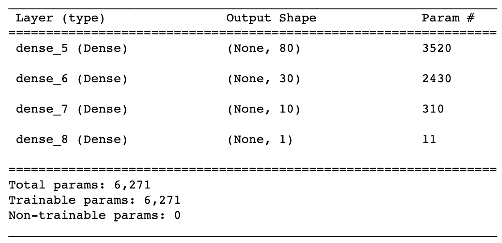

# Neural Network Charity Analysis

## Introduction

The purpose of this project is to use deep neural networks to create a binary classifier that predict applicants success after funded by charity group, Alphabet Soup.

We received a CSV containing more than 34,000 organizations that have received funding from Alphabet Soup over the years. We processed the data using Python, and trained the model using TensorFlow in Python.

## Results

We initially set the neural network model with two hidden layers, 80 and 30 neurons respectively. We used the activation function ReLU for the hidden layers and Sigmoid for the output layer. And adam as the optimizer is and binary_crossentropy as the loss function. The model reached a loss funcion 0.56 and accuracy of 72.8%, which is not satisfying.

In order to increase the epoch from 100 to 200. However, the model didn't show any improvement, with
a loss funcion of 0.56 and accuracy of 72.8%. 

Then we added another hidden layer into the model.

However, this updated model also didn't show any improvement, with a loss funcion of 0.57 and accuracy of 72.9%. 

## Summary
Our deep learning neural network model reached a loss funcion 0.56 and accuracy of 72.9% in predicting success after charity funding. 

To further increase the performance of the model, we might need to look back at the input variables, applied optimization or bucketing to some features.
We can also try to increase the number of neurons on one of the hidden layers, but need to be aware of over-fitting the model. We can also tried different activation functions (tanh) to test if these help to improve the model's performance. 

On the other side, since we are doing binary classification situation, we can also evaluate other supervised machine learning models instead of neural networks, which might perform similarly or better with more simpler code, for example, the Random Forest Classifier.